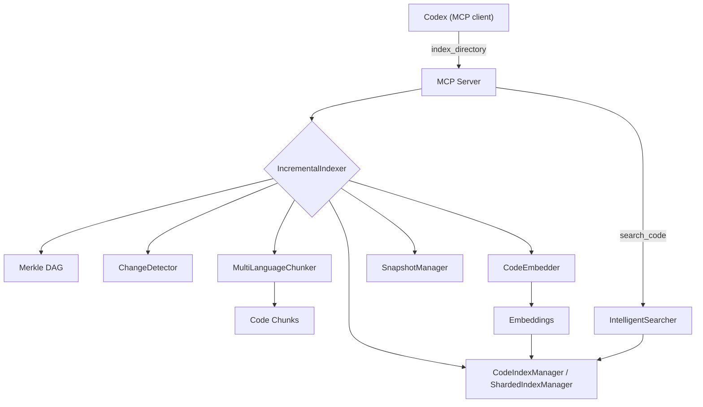

# CODEX.md

This file provides guidance to Codex when working with code in this repository.

## Project Overview

Codex Embedding Search is a fully local semantic code search system powered by EmbeddingGemma and tree-sitter chunking. It integrates with Codex via MCP (Model Context Protocol) to index and search codebases without sending code to the cloud.

## Key Commands

### Development Setup

```bash
# Install dependencies
uv sync

# Install in development mode
uv sync --dev
```

### Testing

```bash
# Run all tests
python tests/run_tests.py

# Run specific test categories
python tests/run_tests.py --unit          # Unit tests only
python tests/run_tests.py --integration   # Integration tests only
python tests/run_tests.py --chunking      # Chunking tests only
python tests/run_tests.py --embeddings    # Embedding tests only
python tests/run_tests.py --search        # Search tests only
python tests/run_tests.py --mcp           # MCP server tests only

# Run tests with coverage
python tests/run_tests.py --coverage

# Run tests with verbose output
python tests/run_tests.py --verbose

# Run specific test files or patterns
python tests/run_tests.py unit/test_chunking.py

# Alternative: Direct pytest usage
python -m pytest                          # All tests
python -m pytest -m "unit"               # Unit tests only
python -m pytest -m "not slow"           # Skip slow tests
python -m pytest tests/unit/test_chunking.py -v  # Single test file
```

### Indexing & Usage

```bash
# Index a repo using the MCP pipeline (recommended for large repos)
uv run --directory ~/.local/share/claude-context-local \
  python scripts/index_repo.py /path/to/repo \
  --project-name MyRepo \
  --sharded \
  --log-file ~/code_search_index.log

# Index with background job
uv run --directory ~/.local/share/claude-context-local \
  python scripts/index_repo.py /path/to/repo \
  --project-name MyRepo \
  --sharded \
  --background \
  --log-file ~/code_search_index.log

# Repair sharded manifest (fast, no reindex)
uv run --directory ~/.local/share/claude-context-local \
  python scripts/index_repo.py /path/to/repo \
  --repair
```

If shards exist but the manifest is empty, `switch_project()` will auto-repair and log a warning.
`switch_project()` also accepts healthy sharded indexes (manifest + shard `code.index` files) without requiring a root `code.index`.

### MCP Server

```bash
# Run MCP server directly
uv run python mcp_server/server.py --transport stdio

# Add to Codex (global)
codex mcp add claude_context_local --scope user -- uv run --directory ~/.local/share/claude-context-local python mcp_server/server.py --transport stdio

# Add to Codex (project-specific)
codex mcp add claude_context_local -- uv run --directory ~/.local/share/claude-context-local python mcp_server/server.py --transport stdio
```

### MCP Tools (Canonical)

This server intentionally exposes a single consolidated tool set (no legacy/`*_v2` tools). Use `list_tools()` inside Codex to discover:

- `search_code`, `find_similar_code`, `get_chunk`
- `index_directory`, `start_index_directory`, `get_index_job_status`, `cancel_index_job`
- `get_stats`, `get_index_status`, `list_projects`, `switch_project`, `clear_index`, `repair_index`
- `fts_status`

## MCP Environment Options

- `CODE_SEARCH_STORAGE`: Base directory for indexes and model cache.
- `CODE_SEARCH_DATA_DIR`: Alias for `CODE_SEARCH_STORAGE`.
- `CODE_SEARCH_DEVICE`: `cpu` | `mps` | `cuda` | `auto`.
- `CODE_SEARCH_PRELOAD_MODEL`: `1` to preload on startup (off by default).
- `CODE_SEARCH_LOG_LEVEL`: `DEBUG` | `INFO` | `WARNING` | `ERROR` | `CRITICAL`.
- `CODE_SEARCH_LOG_FILE`: Path to a logfile (defaults to stderr).
- `CODE_SEARCH_CHUNK_BATCH_SIZE`: chunk batch size for indexing.
- `CODE_SEARCH_BATCH_SIZE`: legacy embed batch size fallback.
- `CODE_SEARCH_EMBED_BATCH_SIZE`: embedding batch size for model encode.
- `CODE_SEARCH_INCLUDE_CONTEXT`: include same-file context in search results.
- `CODE_SEARCH_DISK_WARN_GB`: warn if free disk below this threshold (warn-only).
- `CODE_SEARCH_LARGE_FILE_MB`: warn on files larger than this size (warn-only).
- `CODE_SEARCH_PROGRESS_EVERY_FILES`: emit rate-limited progress events every N files (default 50).
- `CODE_SEARCH_RESUME`: resume interrupted full indexing runs from checkpoint (default on; set `0` to disable).
- `CODE_SEARCH_ASYNC_INDEX`: force `index_directory` to run as a background job (recommended for large repos).
- `CODE_SEARCH_SYNC_INDEX`: force `index_directory` to block until completion (not recommended for large repos).
- `CODE_SEARCH_ASYNC_FILE_THRESHOLD`: file-count heuristic used to auto background-index (default ~2500).
- `CODE_SEARCH_ASYNC_SCAN_SECONDS`: max seconds to spend estimating repo size before defaulting to background indexing (default ~2).
- `CODE_SEARCH_INDEX_WORKERS`: background indexing workers (default 2; restart MCP to apply).
- `CODE_SEARCH_JOB_EVENT_BUFFER`: stored job progress events (default 200).
- `CODE_SEARCH_SHARDED_INDEX`: enable sharded FAISS indexes.
- `CODE_SEARCH_SHARD_TARGET_BYTES`: target shard size before rollover (default ~512MB).
- `CODE_SEARCH_SHARD_MEMORY_CAP_GB`: max RAM budget for loaded shards (default 13).
- `CODE_SEARCH_TRAIN_SAMPLE_MAX`: max training sample vectors stored for IVF readiness (default 25000).
- `CODE_SEARCH_TORCH_BEFORE_FAISS`: Force torch import before FAISS on startup (`true`/`false`).
- `CODE_SEARCH_IGNORE_DIRS`: comma-separated extra ignore patterns for indexing/merkle.
- `CODE_SEARCH_HYBRID`: enable hybrid BM25 + vector search when available.
- `CODE_SEARCH_HYBRID_RRF_K`: RRF fusion k value (default 60).
- `CODE_SEARCH_HYBRID_DENSE_K`: dense candidate count (default 50).
- `CODE_SEARCH_HYBRID_SPARSE_K`: sparse candidate count (default 50).
- `CODE_SEARCH_HYBRID_AUTOBUILD`: background FTS build on fallback (default on).
- `HF_HUB_OFFLINE`: force offline model loading.

## Architecture

### Core Components

- **`chunking/`**: Tree-sitter + text fallback chunking
  - `multi_language_chunker.py`: unified orchestrator
  - `tree_sitter.py`: language-aware tree-sitter chunker
  - `base_chunker.py`: base class for language chunkers
  - `languages/`: per-language metadata extraction
  - `text_chunker.py`: plain-text fallback chunker
- **`embeddings/`**: EmbeddingGemma inference
  - `embedder.py`: model loading, batching, adaptive backoff
- **`search/`**: FAISS-based indexing + metadata
  - `indexer.py`: IndexFlatIP + IDMap2 + SQLite metadata
  - `sharded_index_manager.py`: sharded index manager and memory budget
  - `searcher.py`: intent-aware semantic search + filters
  - `incremental_indexer.py`: Merkle-driven incremental indexing
  - `resume_state.py`: resume-from-checkpoint state
- **`merkle/`**: Change detection
  - `merkle_dag.py`: hash DAG for file tracking
  - `change_detector.py`: add/modify/remove detection
  - `snapshot_manager.py`: snapshot persistence
- **`mcp_server/`**: MCP integration
  - `server.py`: MCP entrypoint
  - `mcp_tools.py`: tool registration

### Data Flow



### Storage Structure

Data is stored in `~/.claude_code_search/` (configurable via `CODE_SEARCH_STORAGE`):

```
~/.claude_code_search/
├── models/          # Downloaded EmbeddingGemma models
├── projects/        # Project-specific data
│   └── {project_hash}/
│       ├── project_info.json
│       ├── index/
│       │   ├── code.index     # Vector index
│       │   ├── metadata.db    # Chunk metadata (SQLite)
│       │   ├── id_map.db      # chunk_id -> int_id
│       │   ├── file_map.db    # file_path -> [int_id]
│       │   ├── stats.json     # Index statistics + metadata + training sample stats
│       │   ├── resume.json    # Resume checkpoint for full indexing
│       │   ├── training_sample.npy
│       │   ├── training_sample_meta.json
│       │   └── training_sample_stats.json
│       ├── shards/            # If sharded indexing is enabled
│       │   └── shard_###/ (code.index, metadata.db, id_map.db, file_map.db, stats.json)
│       ├── manifest.json      # Shard manifest
│       └── snapshots/         # Merkle tree snapshots
```

`stats.json` includes counts (total_chunks, files_indexed), chunk breakdowns, FAISS metadata
(index_type, metric, embedding_dim, trained, nlist, nprobe), training sample stats
(training_sample_count, training_sample_total_seen, training_sample_max), and sanity fields
(`sanity_warning`, `sanity_suggestion`) when metadata exists but vectors are missing.

## Intelligent Chunking

- **Tree-sitter for all supported languages** (Python included)
- **Text fallback** for text-like files or when tree-sitter bindings are missing
- **Document extraction** for `.pdf` and `.docx` before text chunking

### Chunk Types Extracted

Common chunk types include:

- `function`, `method`, `class`, `interface`, `type`, `enum`, `struct`, `union`, `namespace`, `module`, `macro`, `impl`, `trait`
- `constructor`, `destructor`, `property`, `event`, `template`, `concept`, `annotation`
- `script`, `style` (Svelte), `section`, `preamble`, `document` (Markdown)
- `text` (fallback chunks), `module` (whole-file fallback when no nodes are found)

### Rich Metadata (All Languages)

Each chunk stores:

- `file_path`, `relative_path`, `folder_structure`
- `chunk_type`, `name`, `parent_name`
- `start_line`, `end_line`
- `docstring` (when available)
- `decorators` (Python)
- `tags` (language + detected traits)
- `content` + `content_preview`
- document metadata such as `document_type`, `block_kind`, `page_number`, `section_title`, `ocr_used`

Language-specific tags include: `async`, `generator`, `export`, `generic`, `component`, plus the language tag.

## Supported Languages & Extensions

Tree-sitter language map:

- Python: `.py`
- JavaScript: `.js`, `.mjs`, `.cjs`
- JSX: `.jsx`
- TypeScript: `.ts`, `.mts`, `.cts`
- TSX: `.tsx`
- Svelte: `.svelte`
- Go: `.go`
- Rust: `.rs`
- Java: `.java`
- C: `.c`
- C++: `.cpp`, `.cc`, `.cxx`, `.c++`
- C#: `.cs`
- HTML: `.html`, `.htm`
- CSS: `.css`
- JSON: `.json`, `.jsonl`
- YAML: `.yaml`, `.yml`
- TOML: `.toml`
- XML: `.xml`, `.xsd`, `.xsl`, `.xslt`, `.svg`, `.xhtml`
- GraphQL: `.graphql`, `.gql`, `.graphqls`
- Markdown: `.md`
- Astro: `.astro`
- Documents: `.pdf`, `.docx`

Text fallback (when tree-sitter is unavailable or for text-like files):

`.txt`, `.csv`, `.tsv`, `.ini`, `.env`, `.sql` (plus any of the above extensions if tree-sitter parsers are missing).

Document extraction:

- `.pdf` via `pymupdf`
- `.docx` via `python-docx`
- OCR for scanned PDFs is optional and disabled by default; enable with `CODE_SEARCH_PDF_OCR=1`
- OCR requires local Tesseract support; if unavailable, indexing continues without OCR

## Search & Retrieval

- **Index type**: FAISS `IndexFlatIP` wrapped in `IndexIDMap2`
- **Similarity**: cosine similarity via L2-normalized vectors
- **Context**: optional same-file neighbors (`CODE_SEARCH_INCLUDE_CONTEXT=1`)
- **Filters**: glob-aware `file_pattern`, `chunk_type`, `tags`

## Testing Strategy

Tests are organized by component with pytest markers:

- `unit`: Fast, isolated unit tests
- `integration`: End-to-end workflow tests
- `chunking`: Chunking functionality
- `embeddings`: Model loading and embedding generation
- `search`: Indexing and search functionality
- `mcp`: MCP server integration
- `slow`: Time-intensive tests (excluded by default)

## Development Notes

### Key Dependencies

- `sentence-transformers`: EmbeddingGemma model loading and inference
- `faiss-cpu`: Efficient vector similarity search
- `fastmcp`: MCP server implementation for Codex integration
- `sqlitedict`: Persistent metadata storage
- `tree-sitter` & `tree-sitter-language-pack`: Multi-language parsing support
- `click`: Command-line interface utilities
- `pytest`: Testing framework with async support

### Performance Considerations

- Model size: ~300MB (EmbeddingGemma-300m)
- Embedding dimension: 768
- Batch processing: Configurable batch sizes for memory management
- Local processing: All embeddings computed locally, no API calls
- Incremental indexing: Only reprocesses changed files using Merkle snapshots
- Sharded indexing: Cap memory with `CODE_SEARCH_SHARD_MEMORY_CAP_GB`

## Common Tasks

### Modifying Chunking

1. Update or add a language chunker in `chunking/languages/`
2. Add/adjust node mappings in `chunking/multi_language_chunker.py`
3. Add tests in `tests/unit/test_multi_language.py` or language-specific tests

### Modifying Search Behavior

1. Update `searcher.py` for new filtering/ranking logic
2. Modify MCP tool parameters in `mcp_server/mcp_tools.py` if needed
3. Add integration tests in `tests/integration/test_full_flow.py`

### Testing Changes

Always run the full test suite before commits:

```bash
python tests/run_tests.py --coverage
```

For quick iteration during development:

```bash
python tests/run_tests.py --unit --verbose -x
```
