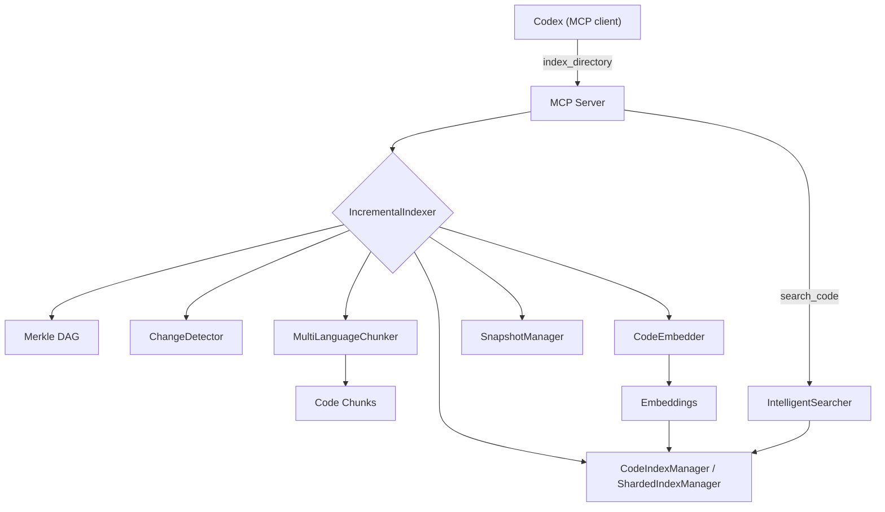

```
  ██████╗ ██╗       █████╗  ██╗   ██╗ ██████╗  ███████╗
 ██╔════╝ ██║      ██╔══██╗ ██║   ██║ ██╔══██╗ ██╔════╝
 ██║      ██║      ███████║ ██║   ██║ ██║  ██║ █████╗
 ██║      ██║      ██╔══██║ ██║   ██║ ██║  ██║ ██╔══╝
 ╚██████╗ ███████╗ ██║  ██║ ╚██████╔╝ ██████╔╝ ███████╗
  ╚═════╝ ╚══════╝ ╚═╝  ╚═╝  ╚═════╝  ╚═════╝  ╚══════╝

  ██████╗  ██████╗  ███╗   ██╗ ████████╗ ███████╗ ██╗  ██╗ ████████╗
 ██╔════╝ ██╔═══██╗ ████╗  ██║ ╚══██╔══╝ ██╔════╝ ╚██╗██╔╝ ╚══██╔══╝
 ██║      ██║   ██║ ██╔██╗ ██║    ██║    █████╗    ╚███╔╝     ██║
 ██║      ██║   ██║ ██║╚██╗██║    ██║    ██╔══╝    ██╔██╗     ██║
 ╚██████╗ ╚██████╔╝ ██║ ╚████║    ██║    ███████╗ ██╔╝ ██╗    ██║
  ╚═════╝  ╚═════╝  ╚═╝  ╚═══╝    ╚═╝    ╚══════╝ ╚═╝  ╚═╝    ╚═╝

 ██╗       ██████╗   ██████╗  █████╗  ██╗
 ██║      ██╔═══██╗ ██╔════╝ ██╔══██╗ ██║
 ██║      ██║   ██║ ██║      ███████║ ██║
 ██║      ██║   ██║ ██║      ██╔══██║ ██║
 ███████╗ ╚██████╔╝ ╚██████╗ ██║  ██║ ███████╗
 ╚══════╝  ╚═════╝   ╚═════╝ ╚═╝  ╚═╝ ╚══════╝

```

[](mailto:farhanalirazaazeemi@gmail.com)

Codex Context without the cloud. Semantic code search that runs 100% locally using EmbeddingGemma. No API keys, no costs, your code never leaves your machine.

- 🔍 **Find code by meaning, not strings**
- 🔒 **100% local - completely private**
- 💰 **Zero API costs - forever free**
- ⚡ **Fewer tokens in Codex and fast local searches**

An intelligent code search system that uses Google's EmbeddingGemma model and advanced multi-language chunking to provide semantic search across modern codebases, integrated with Codex via MCP (Model Context Protocol).

## 🚧 Beta Release

- Core functionality working
- Installation tested on Mac/Linux
- Benchmark harness (fixed mode): `uv run python scripts/bench_mcp_perf.py --out logs/bench.json` (also writes a copy to `$CODE_SEARCH_STORAGE/logs/`)
- Please report issues!

## Demo


## Features

- **Multi-language support**: Tree-sitter chunking for major languages + text fallback for config/docs/data files
- **Intelligent chunking**: AST/Tree-sitter nodes mapped to semantic chunk types
- **Semantic search**: Natural language queries with intent-aware ranking
- **Rich metadata**: File paths, folder structure, names, docstrings, tags, language traits
- **Incremental indexing**: Merkle DAG + snapshots detect changes fast
- **Resume-on-interrupt**: Full indexing resumes from checkpoints by default
- **Sharded FAISS**: Multiple index shards with memory-aware loading
- **Local processing**: All embeddings stored locally, no API calls
- **MCP integration**: Direct Codex tools for index/search/jobs

## Why this

Codex’s code context is powerful, but sending your code to the cloud costs tokens and raises privacy concerns. This project keeps semantic code search entirely on your machine. It integrates with Codex via MCP, so you keep the same workflow—just faster, cheaper, and private.

## Requirements

- Python 3.13+ (Required for macOS ARM support)
- Disk: 1–2 GB free (model + caches + index)
- Optional: NVIDIA GPU (CUDA 11/12) for FAISS acceleration; Apple Silicon (MPS) for embedding acceleration. Everything still works on CPU.

## Install & Update

### Install (one‑liner)

```bash
curl -fsSL https://raw.githubusercontent.com/FarhanAliRaza/claude-context-local/main/scripts/install.sh | bash
```

If your system doesn't have `curl`, you can use `wget`:

```bash
wget -qO- https://raw.githubusercontent.com/FarhanAliRaza/claude-context-local/main/scripts/install.sh | bash
```

### Update existing installation

Run the same install command to update:

```bash
curl -fsSL https://raw.githubusercontent.com/FarhanAliRaza/claude-context-local/main/scripts/install.sh | bash
```

The installer will:

- Detect your existing installation
- Preserve your embeddings and indexed projects in `~/.claude_code_search`
- Stash any local changes automatically (if running via curl)
- Update the code and dependencies

### What the installer does

- Installs `uv` if missing and creates a project venv
- Clones/updates `claude-context-local` in `~/.local/share/claude-context-local`
- Installs Python dependencies with `uv sync`
- Downloads the EmbeddingGemma model (~1.2–1.3 GB) if not already cached
- Tries to install `faiss-gpu` if an NVIDIA GPU is detected (interactive mode only)
- **Preserves all your indexed projects and embeddings** across updates

## Quick Start

### 1) Register the MCP server (stdio)

```bash
codex mcp add claude_context_local --scope user -- uv run --directory ~/.local/share/claude-context-local python mcp_server/server.py --transport stdio
```

Then open Codex; the server will run in stdio mode inside the `uv` environment.

### 2) Index your codebase

Open Codex and say: index this codebase. No manual commands needed.

**Large repos:** `index_directory` automatically switches to a background job to avoid Codex’s ~30-minute per-tool-call timeout. Poll `get_index_job_status` until it shows `status=completed`, then search as normal.

### 3) Use in Codex

The MCP exposes a clean set of tools (no legacy/`*_v2` variants). To see the complete surface area from inside Codex, run: `list_tools()`.

Common workflows:

- Index: `index_directory("/path/to/repo")` (or `start_index_directory(...)` for explicit background jobs)
- Search: `search_code("how auth works", file_patterns=["src/**/*.py"], chunk_type="function", search_mode="auto")`
- Similarity: `find_similar_code(chunk_id="...", k=10)`
- Inspect: `get_chunk(chunk_id="...")`
- Health/coverage: `fts_status(project_path="/path/to/repo")`

### Offline indexing (no Codex usage)

If you want to run indexing yourself (overnight, no token usage), use the MCP pipeline CLI:

```bash
uv run --directory ~/.local/share/claude-context-local \
  python scripts/index_repo.py /path/to/repo \
  --project-name MyRepo \
  --sharded \
  --log-file ~/code_search_index.log
```

Background + polling:

```bash
uv run --directory ~/.local/share/claude-context-local \
  python scripts/index_repo.py /path/to/repo \
  --project-name MyRepo \
  --sharded \
  --background \
  --log-file ~/code_search_index.log
```

Progress monitoring:

- Foreground with a log file: `tail -f ~/code_search_index.log`
- Background CLI mode: watch periodic events printed by `scripts/index_repo.py --background`
- MCP mode: poll `get_index_job_status(job_id="...")`

This uses the same storage/artifacts as the MCP server, so Codex can search immediately once it finishes.
Running via `uv run --directory ~/.local/share/claude-context-local` reuses the canonical MCP environment and uv cache (no extra venvs).

To verify the post-index health (FTS coverage, manifest/stats metadata, per-shard sizes) without re-running indexing, use:

```
/Users/anasdayeh/.local/share/claude-context-local/scripts/check_cs_rag_fts.sh
```

The script prints both JSON and human-friendly summaries and now includes manifest/version details, stats storage size, total FTS rows, and per-shard metrics by default (no extra flags required).

### Incremental refresh for cs-rag

To refresh only changed files without clearing the existing index:

```bash
CS_RAG_REPO_PATH=/absolute/path/to/cs-rag \
  /Users/anasdayeh/.local/share/claude-context-local/scripts/reindex_cs_rag_incremental.sh
```

Progress visibility:

- Script output prints changed files and final status
- Detailed indexing logs: `tail -f ~/cs-rag-incremental-index.log`
- Tune checkpoint frequency (and progress event cadence) with `CODE_SEARCH_CHECKPOINT_CHUNKS`

### Reset indexes + reindex key projects

To wipe all existing project indexes while preserving the model cache, delete the project artifacts under your storage root:

```bash
rm -rf ~/.claude_code_search/projects/*
```

To reindex your key repos sequentially (foreground, one at a time), run:

```bash
./scripts/reindex_key_projects.sh
```

### Repair a broken sharded manifest (no reindex)

If a sharded index exists but the manifest is empty/missing, you can repair it:

```bash
uv run --directory ~/.local/share/claude-context-local \
  python scripts/index_repo.py /path/to/repo \
  --repair
```

If you try to search a project with shards present but an empty manifest, the MCP will
auto-repair on `switch_project` and log a warning. `switch_project` also accepts healthy
sharded indexes (manifest + shard `code.index` files) without requiring a root `code.index`.

## Configuration

Environment variables (set in your MCP server config):

If these values are unset, runtime now applies adaptive defaults from detected
system memory (especially on Apple Silicon) to reduce OOM pressure while keeping
throughput reasonable.

- `CODE_SEARCH_STORAGE` (default: `~/.claude_code_search`)
- `CODE_SEARCH_DATA_DIR` (alias for `CODE_SEARCH_STORAGE`)
- `CODE_SEARCH_DEVICE` (`cpu`, `mps`, `cuda`, `auto`)
- `CODE_SEARCH_EMBED_BACKEND` (`torch`, `onnx`) embedding runtime backend (default `torch`)
- `CODE_SEARCH_PRELOAD_MODEL` (`0`/`1`) preload the embedder in the MCP lifespan hook
- `CODE_SEARCH_RUNTIME_SELFTEST` (`0`/`1`) run a one-time embedder health check at MCP startup (default on in `mcp_server/server.py`)
- `CODE_SEARCH_SEARCH_DISABLE_SEMANTIC_ON_EMBEDDER_FAILURE` (`0`/`1`) degrade `search_code(search_mode=auto|hybrid)` to FTS-only when semantic bootstrap fails
- `CODE_SEARCH_IMPORT_STRATEGY` (`embedder_first`, `default`) keep embedder bootstrap ahead of FAISS-backed index initialization
- `CODE_SEARCH_LOG_LEVEL` (`DEBUG`/`INFO`/`WARNING`/`ERROR`/`CRITICAL`)
- `CODE_SEARCH_LOG_FILE` (path to a logfile; defaults to stderr if unset)
- `CODE_SEARCH_CHUNK_BATCH_SIZE` (chunking batch size; default 100)
- `CODE_SEARCH_BATCH_SIZE` (legacy embed batch size fallback)
- `CODE_SEARCH_EMBED_BATCH_SIZE` (embedding batch size; falls back to `CODE_SEARCH_BATCH_SIZE`)
- `CODE_SEARCH_INCLUDE_CONTEXT` (`0`/`1`) include same-file neighbors in results
- `CODE_SEARCH_DISK_WARN_GB` (warn if free disk below this threshold; warn-only)
- `CODE_SEARCH_LARGE_FILE_MB` (warn on files larger than this size; warn-only)
- `CODE_SEARCH_PROGRESS_EVERY_FILES` (emit rate-limited progress events every N files; default 50)
- `CODE_SEARCH_CHECKPOINT_CHUNKS` (save/checkpoint every N chunks during indexing; default `max(chunk_batch*20,1000)`)
- `CODE_SEARCH_RESUME` (`0`/`1`): resume interrupted full indexing runs from checkpoint (default on)
- `CODE_SEARCH_ASYNC_INDEX` (`0`/`1`): force background indexing for `index_directory`
- `CODE_SEARCH_SYNC_INDEX` (`0`/`1`): force synchronous indexing for `index_directory`
- `CODE_SEARCH_ASYNC_FILE_THRESHOLD` (auto background-index if file count exceeds this; default ~2500)
- `CODE_SEARCH_ASYNC_SCAN_SECONDS` (max seconds to scan repo size before defaulting to background; default ~2)
- `CODE_SEARCH_INDEX_WORKERS` (background indexing workers; default 2; restart MCP to apply)
- `CODE_SEARCH_JOB_EVENT_BUFFER` (max stored progress events per job; default 200)
- `CODE_SEARCH_SHARDED_INDEX` (`0`/`1`): enable sharded FAISS indexes
- `CODE_SEARCH_SHARD_TARGET_BYTES` (target shard size before rollover; default ~512MB)
- `CODE_SEARCH_SHARD_MEMORY_CAP_GB` (max RAM budget for loaded shards; if unset, auto-derived from system RAM)
- `CODE_SEARCH_SHARD_SEARCH_WORKERS` (parallel shard-search workers; auto-tuned when unset)
- `CODE_SEARCH_TRAIN_SAMPLE_MAX` (max training sample vectors for IVF readiness; auto-tuned when unset)
- `CODE_SEARCH_MIN_FREE_RAM_GB` (embedding backoff floor; batch size is reduced below this free-RAM threshold)
- `CODE_SEARCH_CONTENT_PREVIEW_CHARS` (truncate stored `content_preview` to reduce metadata size; default 320)
- `CODE_SEARCH_TORCH_NUM_THREADS` (cap torch intra-op threads for inference stability on laptops)
- `CODE_SEARCH_TORCH_INTEROP_THREADS` (cap torch inter-op threads; usually keep low, e.g. `1`)
- `CODE_SEARCH_TORCH_BEFORE_FAISS` (`true`/`false`) force torch import before FAISS on startup
- `CODE_SEARCH_IGNORE_DIRS` (comma-separated extra ignore patterns for indexing/merkle)
- `CODE_SEARCH_HYBRID` (`0`/`1`) enable hybrid BM25 + vector search when available
- `CODE_SEARCH_HYBRID_RRF_K` (RRF fusion k value; default 60)
- `CODE_SEARCH_HYBRID_DENSE_K` (dense candidate count; default 50)
- `CODE_SEARCH_HYBRID_SPARSE_K` (sparse candidate count; default 50)
- `CODE_SEARCH_HYBRID_AUTOBUILD` (`0`/`1`) background FTS build on fallback (default on)
- `HF_HUB_OFFLINE` (`1` to force offline model loading)
- `PYTORCH_MPS_HIGH_WATERMARK_RATIO` / `PYTORCH_MPS_LOW_WATERMARK_RATIO` (MPS allocator hard/soft limits; now auto-set conservatively on Apple Silicon when not explicitly provided)

Interact via chat inside Codex; no function calls or commands are required.

## Architecture

```
claude-context-local/
├── chunking/                         # Multi-language chunking (Tree-sitter + text fallback)
│   ├── multi_language_chunker.py     # Unified orchestrator
│   ├── tree_sitter.py                # Tree-sitter chunker
│   ├── base_chunker.py               # Language chunker base + TreeSitterChunk
│   ├── languages/                    # Language-specific chunkers
│   └── text_chunker.py               # Text fallback chunker
├── embeddings/
│   └── embedder.py                   # EmbeddingGemma wrapper + batching + OOM backoff
├── search/
│   ├── indexer.py                    # FAISS index + metadata storage
│   ├── sharded_index_manager.py      # Sharded FAISS manager + memory budget
│   ├── searcher.py                   # Semantic search + intent ranking
│   ├── incremental_indexer.py        # Merkle-driven incremental indexing
│   └── resume_state.py               # Resume-from-checkpoint state
├── merkle/
│   ├── merkle_dag.py                 # Content-hash DAG of the workspace
│   ├── change_detector.py            # Diffs snapshots to find changed files
│   └── snapshot_manager.py           # Snapshot persistence
├── mcp_server/
│   ├── server.py                     # MCP entrypoint (stdio/http)
│   └── mcp_tools.py                  # MCP tool registration
└── scripts/
    ├── install.sh                    # One-liner remote installer (uv + model + faiss)
    ├── download_model_standalone.py  # Pre-fetch embedding model
    └── index_repo.py                 # Offline indexing pipeline
```

### Data flow



### Storage layout

Default base directory: `~/.claude_code_search` (override with `CODE_SEARCH_STORAGE`).

```
~/.claude_code_search/
├── models/          # Cached embedding models
├── projects/
│   └── {project_hash}/
│       ├── project_info.json
│       ├── index/
│       │   ├── code.index           # FAISS index (flat + cosine)
│       │   ├── metadata.db          # Chunk metadata (SQLite)
│       │   ├── id_map.db            # chunk_id -> int_id
│       │   ├── file_map.db          # file_path -> [int_id]
│       │   ├── stats.json           # Index stats + index metadata + training sample stats
│       │   ├── resume.json          # Full-index resume checkpoint
│       │   ├── training_sample.npy  # Optional training sample vectors
│       │   ├── training_sample_meta.json
│       │   └── training_sample_stats.json
│       ├── shards/                  # If sharded indexing enabled
│       │   └── shard_###/ (code.index, metadata.db, id_map.db, file_map.db, stats.json)
│       └── manifest.json            # Shard manifest
│       └── snapshots/               # Merkle snapshots
```

`stats.json` includes counts (total_chunks, files_indexed), chunk breakdowns, FAISS metadata
(index_type, metric, embedding_dim, trained, nlist, nprobe), training sample stats
(training_sample_count, training_sample_total_seen, training_sample_max), and sanity fields
(`sanity_warning`, `sanity_suggestion`) when metadata exists but vectors are missing.

## Intelligent Chunking

The system uses advanced parsing to create semantically meaningful chunks across all supported languages.

### Chunking strategies

- **Tree-sitter for all supported languages** (Python included)
- **Text fallback** for text-like files or when tree-sitter bindings are missing
- **Document extraction** for `.pdf` and `.docx` before text chunking

### Chunk types extracted

Chunk types are mapped from tree-sitter node types and may include:

- **Code structures**: `function`, `method`, `class`, `interface`, `type`, `enum`, `struct`, `union`, `namespace`, `module`, `macro`, `impl`, `trait`
- **Language constructs**: `constructor`, `destructor`, `property`, `event`, `template`, `concept`, `annotation`
- **UI/document chunks**: `script`, `style` (Svelte), `section`, `preamble`, `document` (Markdown)
- **Fallback**: `text` (plain-text chunking), `module` (whole-file fallback if tree-sitter returns no nodes)

### Rich metadata (all languages)

Each chunk stores:

- `file_path`, `relative_path`, `folder_structure`
- `chunk_type`, `name`, `parent_name`
- `start_line`, `end_line`
- `docstring` (where available)
- `decorators` (Python)
- `tags` (language tag + detected traits)
- `content` + `content_preview`
- document metadata such as `document_type`, `block_kind`, `page_number`, `section_title`, `ocr_used`

Language-specific tags include: `async`, `generator`, `export`, `generic`, `component`, plus the language name itself.

### Supported languages & extensions

Tree-sitter language map:

- Python: `.py`
- JavaScript: `.js`, `.mjs`, `.cjs`
- JSX: `.jsx`
- TypeScript: `.ts`, `.mts`, `.cts`
- TSX: `.tsx`
- Svelte: `.svelte`
- Go: `.go`
- Rust: `.rs`
- Java: `.java`
- C: `.c`
- C++: `.cpp`, `.cc`, `.cxx`, `.c++`
- C#: `.cs`
- HTML: `.html`, `.htm`
- CSS: `.css`
- JSON: `.json`, `.jsonl`
- YAML: `.yaml`, `.yml`
- TOML: `.toml`
- XML: `.xml`, `.xsd`, `.xsl`, `.xslt`, `.svg`, `.xhtml`
- GraphQL: `.graphql`, `.gql`, `.graphqls`
- Markdown: `.md`
- Astro: `.astro`
- Documents: `.pdf`, `.docx`

Text fallback (when tree-sitter is unavailable or for text-like files):

`.txt`, `.csv`, `.tsv`, `.ini`, `.env`, `.sql` (plus any of the above extensions if tree-sitter parsers are missing).

Document extraction:

- `.pdf` via `pymupdf`
- `.docx` via `python-docx`
- OCR for scanned PDFs is optional and disabled by default; enable with `CODE_SEARCH_PDF_OCR=1`
- OCR requires local Tesseract support; if unavailable, indexing continues without OCR

## Search & Retrieval

- **Index type**: FAISS `IndexFlatIP` wrapped in `IndexIDMap2`
- **Similarity**: cosine similarity via L2-normalized vectors
- **Context**: optional same-file neighbors (`CODE_SEARCH_INCLUDE_CONTEXT=1`)
- **Filters**: glob-aware `file_pattern`, `chunk_type`, `tags`

## Performance & Reliability

- **Adaptive embedding batch backoff** to survive OOM on MPS/CUDA
- **Warn-only disk/large-file checks** (configurable via env)
- **Resume checkpoints** for long full-index runs
- **Sharded search** with memory-aware shard grouping

## Troubleshooting

### Common Issues

1. **Import errors**: Ensure all dependencies are installed with `uv sync`
2. **Model download fails**: Check internet connection and disk space
3. **Memory issues**: Reduce `CODE_SEARCH_EMBED_BATCH_SIZE`, lower `CODE_SEARCH_TORCH_NUM_THREADS`, and optionally try `CODE_SEARCH_EMBED_BACKEND=onnx`
4. **`Transport closed` during `search_code`**: enable `CODE_SEARCH_RUNTIME_SELFTEST=1`, keep `CODE_SEARCH_IMPORT_STRATEGY=embedder_first`, and check `get_index_status` / `list_tools` for `embedder_status`, `embedder_backend`, and `embedder_failure_summary`
5. **No search results**: Verify the codebase was indexed successfully
6. **FAISS GPU not used**: Ensure `nvidia-smi` is available and CUDA drivers are installed; re-run installer to pick `faiss-gpu-cu12`/`cu11`
7. **Force offline**: set `HF_HUB_OFFLINE=1`

### Apple Silicon low-memory profile (M1/M2 laptops)

```bash
export CODE_SEARCH_DEVICE=auto
export CODE_SEARCH_EMBED_BACKEND=onnx
export ST_ONNX_PROVIDER=CPUExecutionProvider
export CODE_SEARCH_EMBED_BATCH_SIZE=2
export CODE_SEARCH_TORCH_NUM_THREADS=2
export CODE_SEARCH_TORCH_INTEROP_THREADS=1
```

### Ignored directories (for speed and noise reduction)

`node_modules`, `.venv`, `venv`, `env`, `.env`, `.direnv`, `__pycache__`, `.pytest_cache`, `.mypy_cache`, `.ruff_cache`, `.pytype`, `.ipynb_checkpoints`, `build`, `dist`, `out`, `public`, `.next`, `.nuxt`, `.svelte-kit`, `.angular`, `.astro`, `.vite`, `.cache`, `.parcel-cache`, `.turbo`, `coverage`, `.coverage`, `.nyc_output`, `.gradle`, `.idea`, `.vscode`, `.docusaurus`, `.vercel`, `.serverless`, `.terraform`, `.mvn`, `.tox`, `target`, `bin`, `obj`

## Contributing

This is a research project focused on intelligent code chunking and search. Feel free to experiment with:

- Different chunking strategies
- Alternative embedding models
- Additional language support
